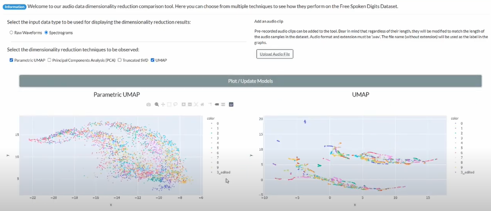
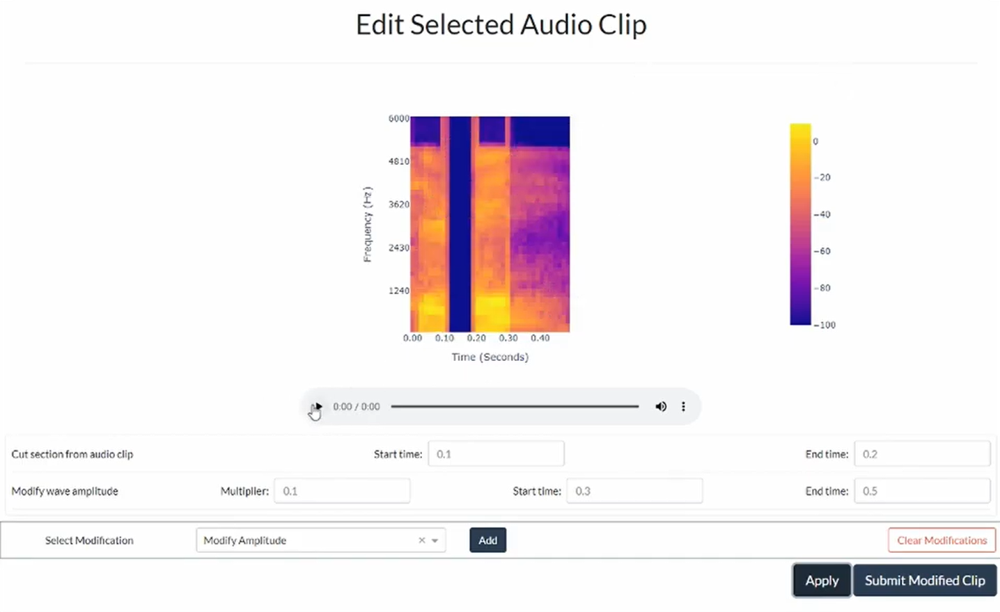

# Dimensionality reduction for audio applications
This repository contains the implementations of a Dash application created for exploring audio datasets and their
interaction with different dimensionality reduction techniques.

## Structure
Most of the python files are located in the root folder, excepting for those containing model implementation or those
 directly used/executed with the Dashboard, in which case, they are located in the corresponding folder (dashboard or 
 models)

## Data
The current version of the Dashboard is made to support 3 different datasets. 
The [Free Spoken Digit Dataset](https://github.com/Jakobovski/free-spoken-digit-dataset), a 
synthetic dataset (which is created by the script `synthetic_dataset.py`) and a private set of neural network
embeddings.

## Installation
The libraries used can be found in the `requirements.txt` file. However, in order to be able to use parametrics
UMAP the install process is a little different. In addition to installing the `requirements.txt` it necessary
to install the packages mentioned at the start of this
 [publicly available colab notebook](https://colab.research.google.com/drive/1L0W9IibHMPw3k35k1NSqz4HuN-ffKUgM) 
 released by the authors of Parametric UMAP. 

## Configuration
The `config.yaml` file contains the most important configuration for the tool. For example, the spectrogram
setup is defined here, as well as the datasets' characteristics and the input types. Changes to any
of this sections will affect the way the tool works. 

## Execution
In order to run the dashboard with each dataset, different scripts must be executed. You view a better
detail in the file `commands.sh`

## Demo
A brief introduction and a demo of the tool can be viewed in [this youtube video](www.youtube.com/watch?v=n3R727QA1qo). 

## Some print screens

Print screen of the main section of the tool where the 2-d representation of audio waveforms and spectrograms can be 
viewed, as well as upload audio clips to be included in the existing graphs.

In the edit clip section a recording can be modified to see how these changes influence the 2-d representation
created by the dimensionality reduction techniques

